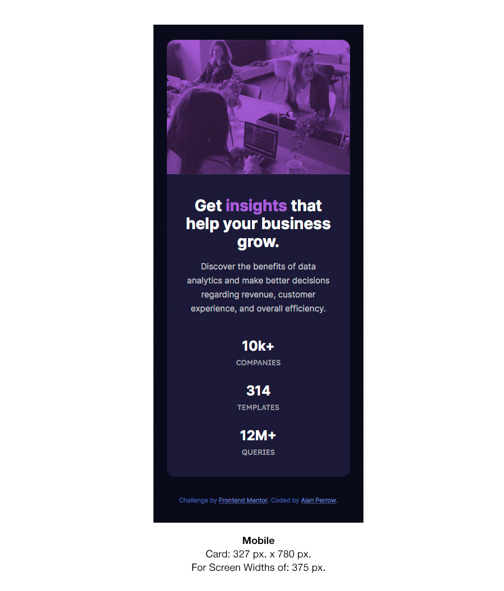
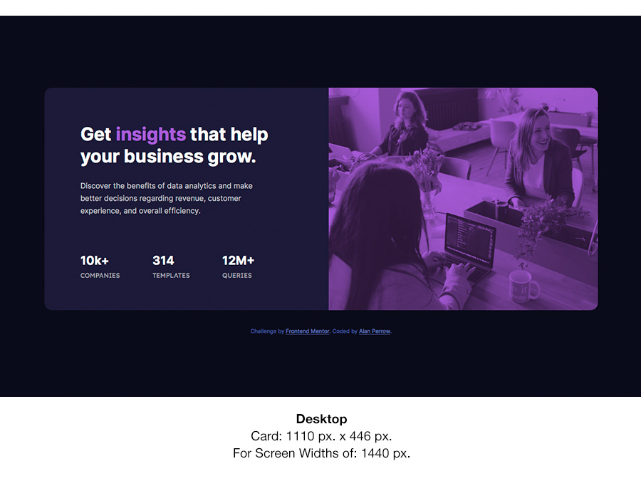

# Frontend Mentor - Stats preview card component solution

This is a solution to the [Stats preview card component challenge on Frontend Mentor](https://www.frontendmentor.io/challenges/stats-preview-card-component-8JqbgoU62). Frontend Mentor challenges help you improve your coding skills by building realistic projects. 

## Table of contents

- [Overview](#overview)
  - [The challenge](#the-challenge)
  - [Screenshot](#screenshot)
  - [Links](#links)
- [My process](#my-process)
  - [Built with](#built-with)
  - [What I learned](#what-i-learned)
  - [Continued development](#continued-development)
  - [Useful resources](#useful-resources)
- [Author](#author)
- [Acknowledgments](#acknowledgments)


## Overview

### The challenge

Users should be able to:

- View the optimal layout depending on their device's screen size. This challenge/project has two layouts to create, one a mobile layout to be viewed at 375 px. and the second, a desktop layout to be viewed at 1440 px.

**Note:** These two layouts will change responsively relative to each layout's designed screen size. For example, the mobile view remains in place until 1249 px. and then the desktop view swaps in at 1250 px. as a starting place to begin to fulfill the 1440 px. desktop view requirement.

### Screenshots

The screenshots below are from my finish challenge views. They're both shot from Safari on the Mac.





### Links

- Solution URL: [GitHub Repository — Solution Files](https://github.com/Stosh12/stats-preview-card-component.git)
- Live Site URL: [GitHub Pages — Solution Website](https://stosh12.github.io/stats-preview-card-component/)

## My process

### Built with

- Semantic HTML5 markup
- CSS custom properties
- Flexbox
- Mobile-first workflow
- Visual Studio Code
- MacDown to create the ReadMe file
- Photoshop for layout templates and ReadMe file screenshot edits

### What I learned

I believe my preplanning for CSS Flexbox is becoming more efficient. I used CSS Flexbox for the stats list and due to my structuring in HTML and CSS that list came together rather well without needing significant modifications after my preplanning.

The most significant thing I learned was that one can swap out foreground images placed within the HTML with a CSS declaration per each media query. The declaration contains the property, "content" with the value of the new image's URL, as shown in the CSS below. Without this ability to swap out foreground images, I would have had to use background images instead, which would work; but swapping out the foreground image was more efficient and used less code considering I was using a blending mode on that same image.

Also, I learned about using blending modes with foreground images by using the CSS property "mix-blend-mode:", as shown in the CSS below.<br><br>

#### HTML

```html
  <div class="stats-pre-card-main-photo">
  
	</div>
```
<br>

#### CSS with the "content" property

The below was used with the only media query in this project, which uses a min-width of 1250px for mainly desktop displays. The "content" property with its URL value can be found at the bottom of the ".stats-pre-card-main-photo img" selector.

```css
@media screen and (min-width: 1250px) {

.stats-pre-card-main-photo {
    float: right;
    width: 540px;
    border-top-left-radius: 0px;
    border-top-right-radius: 15px;
    border-bottom-right-radius: 15px;
    background-color: hsl(277, 64%, 61%);
}
.stats-pre-card-main-photo img {
    border-top-left-radius: 0px;
    border-top-right-radius: 15px;
    border-bottom-right-radius: 15px;
    content: url(../images/image-header-desktop.jpg);
}

}
```
<br>

#### CSS with the "mix-blend-mode" property

The below was used for the mobile view; but its "position", "display", "mix-blend-mode" and "opacity" properties cascade or carry on through to the desktop iteration of this CSS selector (.stats-pre-card-main-photo img) within the desktop media query for this project, which is shown below in the next CSS example. This "mix-blend-mode" property is used in the CSS selector, ".stats-pre-card-main-photo img", which contains the B & W foreground image. This blend mode is set to multiply with an opacity of 75%, which blends the B & W photo into the violet background color [ hsl(277, 64%, 61%) ] of its containing element or div, ".stats-pre-card-main-photo." The result creates the appearance similar to that of a sheet of transparent violet plastic or gel overlaying the B & W photo where only the values of black and violet are shown blended together.

```css
.stats-pre-card-main-photo {
    position: relative;
    display: block;
    border-top-left-radius: 15px;
    border-top-right-radius: 15px;
    background-color: hsl(277, 64%, 61%);
}
.stats-pre-card-main-photo img {
    position: relative;
    display: block;
    border-top-left-radius: 15px;
    border-top-right-radius: 15px;
    mix-blend-mode: multiply;
    opacity: 75%;
}
```
<br>

### Continued development

I would like to continue working with Flexbox and getting even better with it. I have found that it can be more efficient and easier to use than standard CSS positioning. CSS Grid, which I didn't use in this project, is another alternative to Flexbox; but its another CSS styling technique or method I would like to continue learning more about.

Now that I know I can swap out foreground images within a design per media query at different screen sizes, this opens up a whole new avenue and approach I can use with placing images into my code. I may no longer need to use background images as much and can take advantage of some of the features that foreground images have over background images. The both have their pluses and minuses; knowing this give me more flexibility for greater efficiency and better coding in the future.

Another, takeaway is that I may continue to use the "mix-blend-mode" on future projects with foreground images when needed now that I know about it.


### Useful resources

- [Changing image src depending on screen size](https://stackoverflow.com/questions/30460681/changing-image-src-depending-on-screen-size) - This code at the end of this thread helped me learn about swapping out foreground images via the "content" property in CSS. It swaps out the image src based upon media query screen size. 
- [CSS mix-blend-mode Property](https://www.w3schools.com/cssref/pr_mix-blend-mode.asp) - This link speaks to blending a container with a red background with the image within the "img" element within it.


## Author

- Website — Porfolio - [Alan Perrow](https://apmail127.myportfolio.com)
- Frontend Mentor - [@stosh12](https://www.frontendmentor.io/profile/stosh12)


## Acknowledgments

I give thanks to Frontend Mentor for creating and hosting these challenge, which have helped me learn more about front end Web Design coding!

